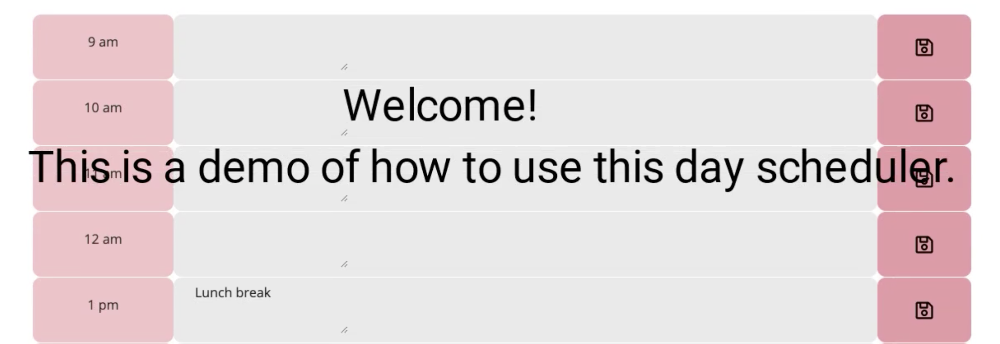
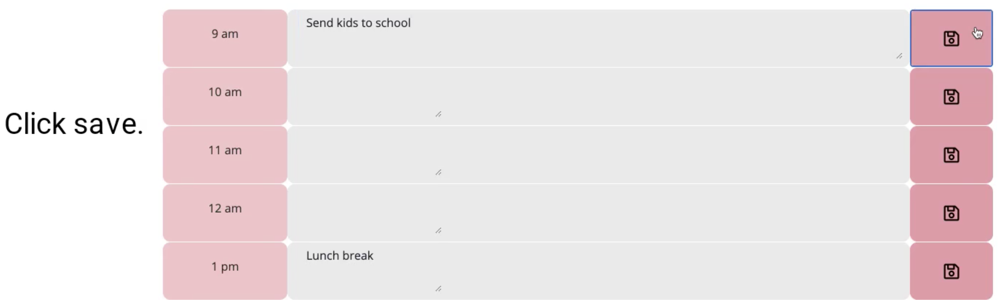
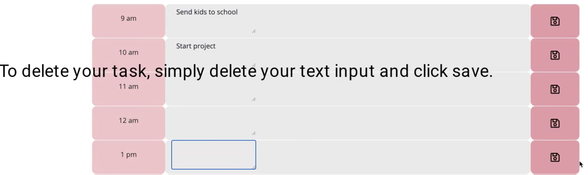

# homework5: Day Scheduler

This is my first day scheduler. It is created to help people to keep things on track.

## Instruction

1. Click on the input area next to time
   1.1 To expand the text area, simply drag the box to your right
   
2. Type in your tasks

3. Click on the save icon on the same line.

4. Your task is now saved in local storage! When you click refresh, your tasks will be saved.

5. To remove task simply click on the input area again, delete, and save.

## Author
Triology and myself

Thank you and enjoy~
